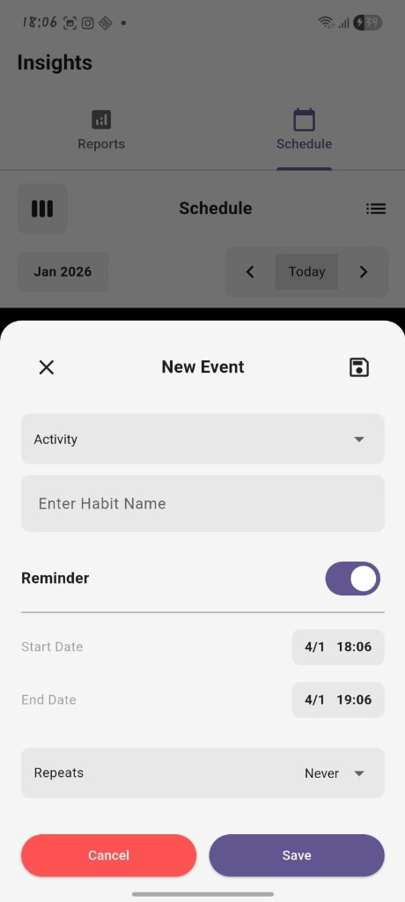
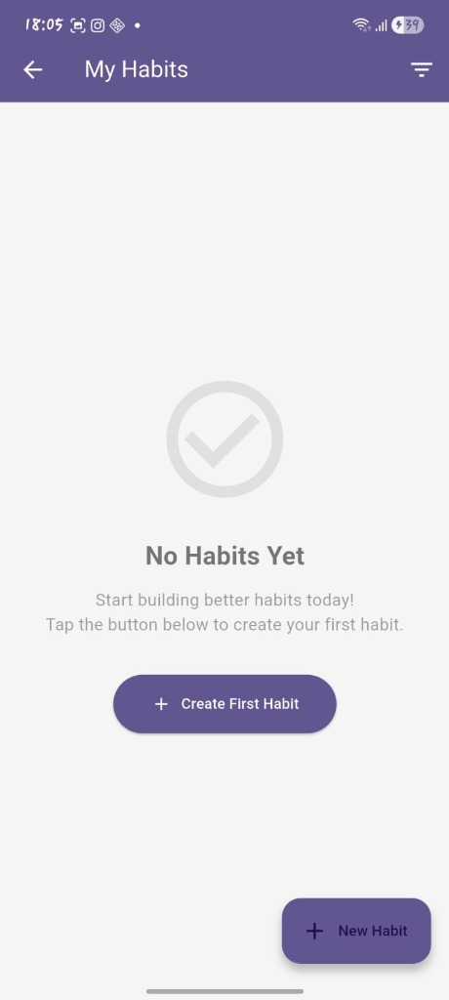
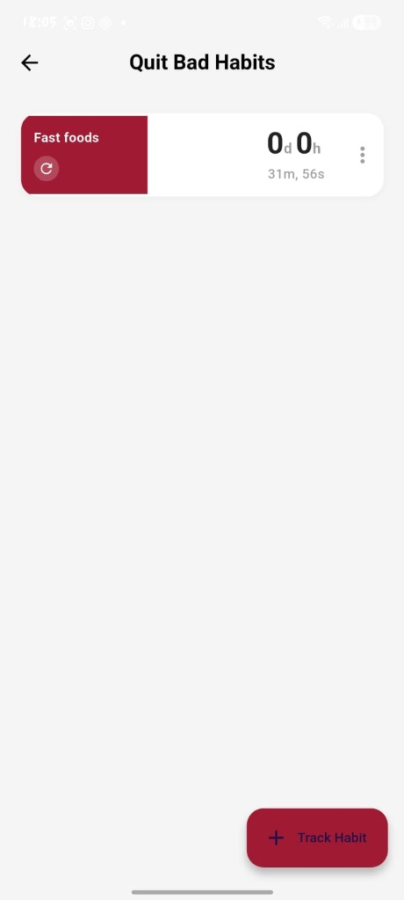
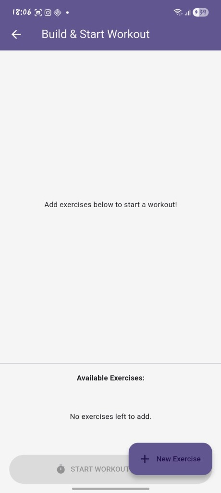
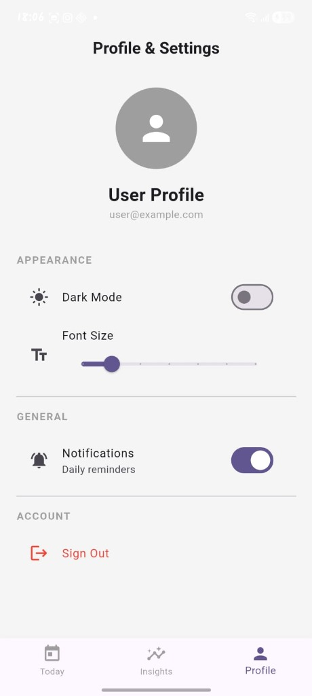

# Track Bestie - Daily Tracker App

A comprehensive Flutter application for tracking daily habits, fitness activities, meals, and personal goals. Built with modern Flutter architecture and Material Design principles.

## Features

###  Daily Tracking
- **Habit Tracking**: Create and monitor custom daily habits with visual progress indicators
- **Quit Habits**: Track progress on breaking unwanted habits with streak counters
- **Daily Checklist**: Manage daily tasks and to-dos with completion tracking
- **Custom Trackers**: Add personalized tracking categories for any aspect of your life

###  Fitness & Health
- **Step Counter**: Automatic step tracking using device sensors
- **Exercise Management**: Create and manage custom workout routines
- **Workout Timer**: Built-in timer for exercise sessions
- **Activity Logging**: Track various fitness activities with detailed metrics

###  Analytics & Insights
- **Visual Reports**: Beautiful charts and graphs showing your progress over time
- **Heatmaps**: Calendar-based heatmaps for habit consistency visualization
- **Consistency Tracking**: Bar charts displaying daily, weekly, and monthly trends
- **Progress Dashboard**: Comprehensive overview of all your tracked activities

### Smart Notifications
- **Daily Reminders**: Scheduled notifications to keep you on track
- **Habit Alerts**: Customizable reminders for specific habits
- **Streak Notifications**: Celebrate your achievements and maintain momentum

###  Additional Features
- **Focus Mode**: Dedicated screen for concentration and productivity tracking
- **Schedule Management**: Plan and organize your daily activities
- **Offline Support**: Full functionality without internet connection
- **Local Data Storage**: All data stored securely on your device using SQLite

##  Tech Stack

- **Framework**: Flutter 3.0+
- **State Management**: Riverpod
- **Database**: SQLite (sqflite)
- **Charts**: FL Chart
- **Notifications**: Flutter Local Notifications
- **Sensors**: Pedometer for step tracking
- **Permissions**: Permission Handler

##  Screenshots

### Schedule & Planning
<div align="center">
  
  <p><em>Create and schedule future events with customizable reminders and repeat options</em></p>
</div>

### Habit Management
<div align="center">
  
  <p><em>Manage all your habits in one place with easy creation and organization</em></p>
</div>

### Quit Bad Habits
<div align="center">
  
  <p><em>Track your progress in breaking unwanted habits with real-time counters</em></p>
</div>

### Fitness & Workouts
<div align="center">
  
  <p><em>Build custom workout routines with exercise management</em></p>
</div>

### Settings & Profile
<div align="center">
  
  <p><em>Customize your experience with dark mode, font size, and notification preferences</em></p>
</div>


##  Getting Started

### Prerequisites
- Flutter SDK 3.0.0 or higher
- Dart SDK
- Android Studio / VS Code with Flutter extensions
- Android device or emulator (API level 21+)

### Installation

1. **Clone the repository**
   ```bash
   git clone https://github.com/jlaura19/daily_tracker_app.git
   cd daily_tracker_app
   ```

2. **Install dependencies**
   ```bash
   flutter pub get
   ```

3. **Run the app**
   ```bash
   flutter run
   ```

### Building for Release

**Android APK:**
```bash
flutter build apk --release
```

**Android App Bundle:**
```bash
flutter build appbundle --release
```

The release APK will be available at:
```
build/app/outputs/flutter-apk/app-release.apk
```

##  Project Structure

```
lib/
├── database/           # SQLite database helper
├── models/            # Data models
│   ├── checklist_model.dart
│   ├── exercise_models.dart
│   ├── quit_habit.dart
│   ├── tracker_type.dart
│   └── tracking_entry.dart
├── services/          # Background services
│   └── notification_service.dart
├── state/             # Riverpod state management
│   ├── checklist_notifier.dart
│   ├── exercise_notifier.dart
│   ├── quit_habit_notifier.dart
│   ├── settings_notifier.dart
│   ├── step_notifier.dart
│   ├── tracker_notifier.dart
│   └── workout_timer_notifier.dart
└── ui/                # User interface screens & widgets
    ├── screens/       # Main app screens
    └── widgets/       # Reusable UI components
```

##  Configuration

### Android Permissions

The app requires the following permissions (automatically configured):
- `ACTIVITY_RECOGNITION` - For step counting
- `POST_NOTIFICATIONS` - For reminder notifications
- `RECEIVE_BOOT_COMPLETED` - For persistent notifications

### Build Configuration

The app uses:
- **Min SDK**: 21 (Android 5.0)
- **Target SDK**: Latest
- **Java Version**: 11
- **Core Library Desugaring**: Enabled for modern Java APIs

##  Contributing

Contributions are welcome! Please feel free to submit a Pull Request.

1. Fork the repository
2. Create your feature branch (`git checkout -b feature/AmazingFeature`)
3. Commit your changes (`git commit -m 'Add some AmazingFeature'`)
4. Push to the branch (`git push origin feature/AmazingFeature`)
5. Open a Pull Request

##  License

This project is licensed under the MIT License - see the LICENSE file for details.

##  Author

**Julien T.**
- GitHub: [@jlaura19](https://github.com/jlaura19)

##  Acknowledgments

- Flutter team for the amazing framework
- All open-source contributors whose packages made this app possible

##  Support

If you encounter any issues or have questions, please file an issue on the GitHub repository.

---

**Made with ❤️ using Flutter**
